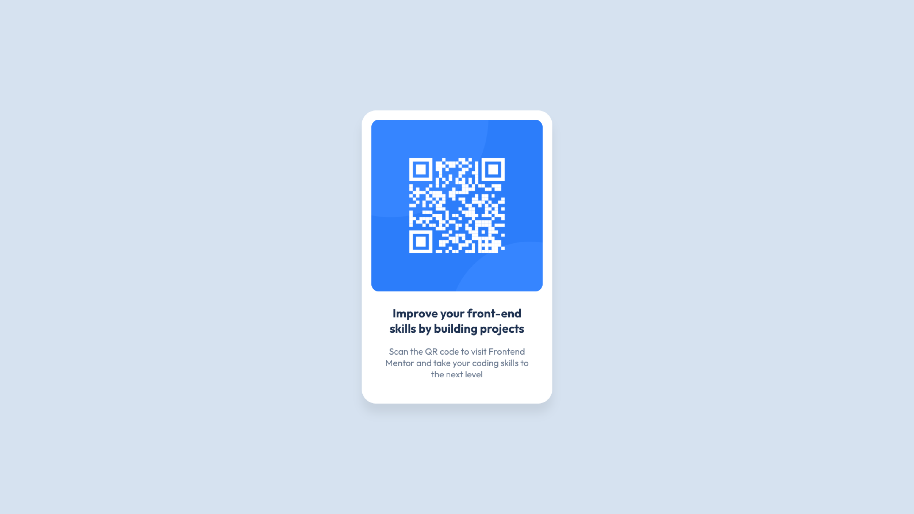

# Frontend Mentor - QR code component solution

This is a solution to the [QR code component challenge on Frontend Mentor](https://www.frontendmentor.io/challenges/qr-code-component-iux_sIO_H). Frontend Mentor challenges help you improve your coding skills by building realistic projects. 

## Table of contents

- [Frontend Mentor - QR code component solution](#frontend-mentor---qr-code-component-solution)
  - [Table of contents](#table-of-contents)
  - [Overview](#overview)
    - [Screenshot](#screenshot)
    - [Links](#links)
  - [My process](#my-process)
    - [Built with](#built-with)
    - [What I learned](#what-i-learned)
    - [Continued development](#continued-development)
    - [AI Collaboration](#ai-collaboration)
  - [Author](#author)

## Overview

### Screenshot



### Links

- Solution URL: [https://github.com/faridreaming/qr-code-component](https://github.com/faridreaming/qr-code-component)
- Live Site URL: [https://faridreaming.my.id/qr-code-component/](https://faridreaming.my.id/qr-code-component/)

## My process

### Built with

- Semantic HTML5 markup
- Modern CSS
- Flexbox

### What I learned

I practiced modern CSS nesting, which made my stylesheet cleaner and less repetitive.

```css
& > div {
  padding: 1.5rem 0.75rem;
  display: flex;
  flex-direction: column;
  gap: 1rem;
  & > h1 {
    color: hsl(218, 44%, 22%);
    font-size: 1.25rem;
  }
  & > p {
    color: hsl(216, 15%, 48%);
    font-size: 15px;
  }
}
```

### Continued development

Next, I want to focus on writing HTML that is semantic and CSS that is consistent.

### AI Collaboration

I used GitHub Copilot in VS Code to ask common questions and clarify concepts, not to generate code.

## Author

- Website - [https://faridreaming.my.id/](https://faridreaming.my.id/)
- Frontend Mentor - [@faridreaming](https://www.frontendmentor.io/profile/faridreaming)
- X - [@faridreaming](https://x.com/faridreaming)
- Instagram - [@frddev](https://www.instagram.com/frddev)
